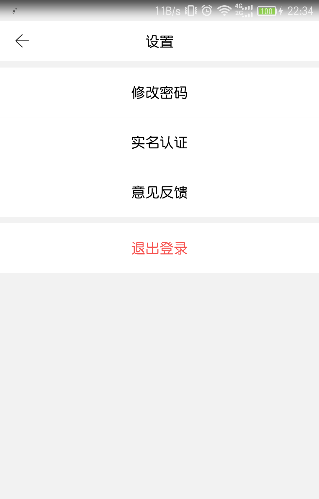
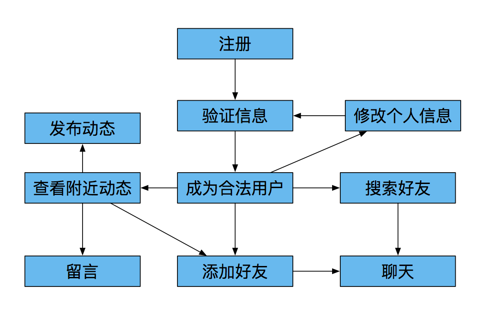
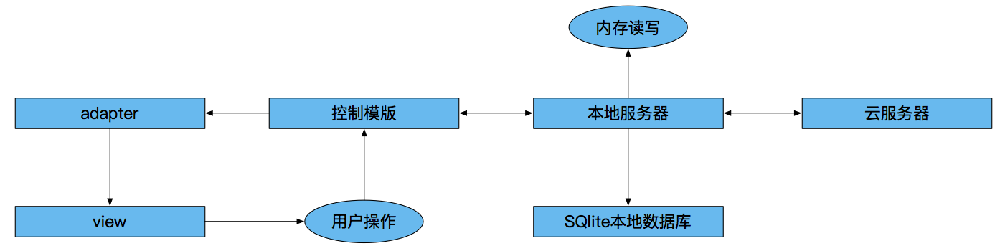
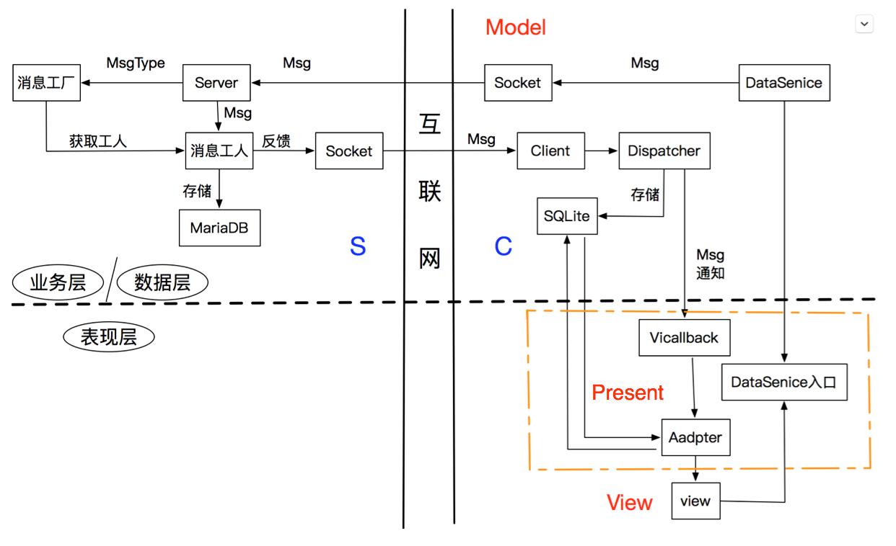
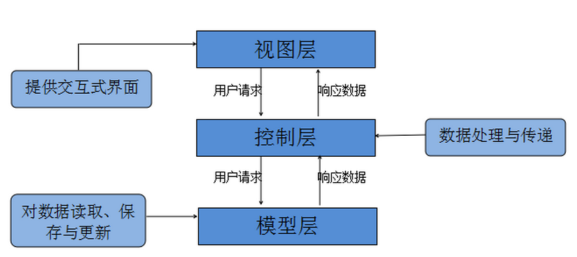
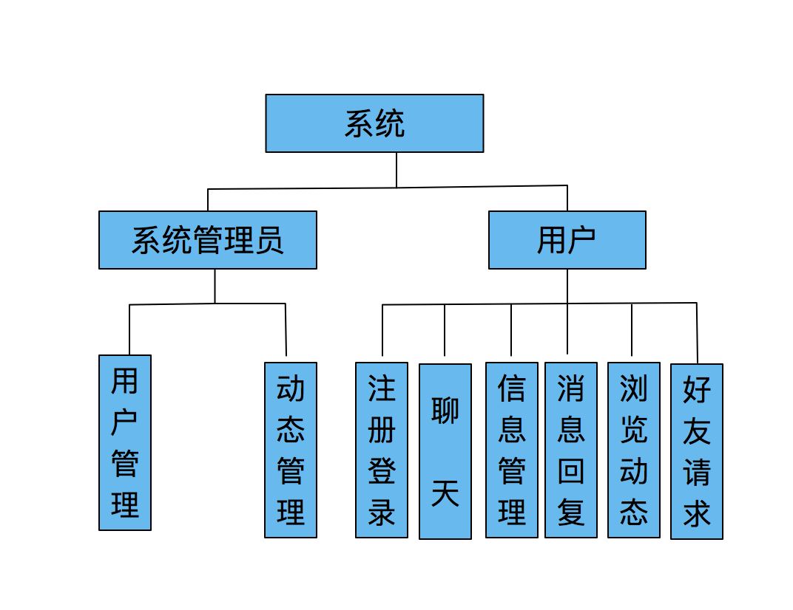

# 邻聚，寻找身边的知己

邻聚是一款基于地理位置校友交友平台APP，含Android前端和用Java编写的后端。

## 项目背景

> 随着网络的普及化，人们对社交的需求愈发增大。
>
> 对于大学生而言，有一个基于地理位置的社交平台，可以方便地联络校友情谊以及获取校友资源；而对于社会人员来说，比如说小区住户，这样一款软件可以方便地建立邻里关系，共同探讨社区生活事宜。
>
> 在这个背景下，制作一款基于地理位置的、安全透明的社区交友平台也是一个不容忽视的需求。

基于这个需求，我们决定制作这样一款基于地理位置的社交平台，为有需求的人群提供相应的服务。当然，目前我们这个项目主要面向的还是在校大学生群体，在之后的版本迭代中可以逐渐扩大受众人群。

本项目是基于Android的使用地理位置进一步促进大学生交友的社交APP，它可以用于同一所大学内或同一个地区的大学生相互之间的实时地理位置共享和聊天。

---

本项目计划制作一个基于地理位置的大学生交友社区APP。软件的功能包含基本的聊天功能、发布动态、相互留言、基于地理位置查询附近的人。注册过程中，用户需要同意软件获取他的地理位置。

在运行维持上，我们计划在用户动态的界面中，可以适当的植入广告，获取一定得利益用于软件的维护。

我们制作该软件的初衷是为了让更多的大学生能够在一个相对比较安全透明的社区中进行聊天交友，并且通过查找附近的人功能让社交在安全的基础上变得简单有趣。对于同一地区的校友可以让他们有机会了解对方，得以交流。同时建立一个基本信息透明的聊天软件，让大家在聊天的过程中可以进一步的相互信任。让人们重新享有人与人之间被虚拟世界剥夺的信任感。

## 基本功能
-  支持的账号注册／登录 / 实名认证
-  支持个人资料修改
-  支持发表文本和图片两种类型信息
-  发布动态并携带地理位置
-  支持查看附近⽤户发表的动态
-  支持留言和查看个人详情
-  支持个⼈动态主⻚页
-  支持SSL安全通信协议
-  发布动态时支持九宫格图⽚片形式
-  支持GIF动态发布和⼩视频播放
-  有动画特效(点击效果和背景特效)
-  开发文档
-  [消息字设计](.github/msg)

## UI预览

1. 登录载入

    </img>

2. 登录/注册界面

    </img>
	</img>

3. 动态列表

    </img>
    </img>

4. 联系人列表(按拼音顺序)/设置(扁平活动标签)

    </img>
	</img>

## UML

系统流程图：

    </img>

对象图：

    </img>

后台架构图：

    </img>

系统架构：

    </img>

核心业务逻辑：

    </img>

权限逻辑划分：

    </img>

运行图：

    </img>

登录逻辑：

    </img>

    </img>
